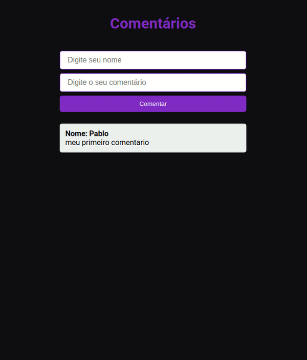

## 💻 Project

<h1 align="center">
    
</h1>

## 🚀 About application

- This is a simple application made in GraphQL and ReactJS. The user writes a comment, and it displays in the listing

## 🔥️ Technologies used

The project was developed using the following technologies:

- [NodeJS](https://nodejs.org/en/)
- [GraphQL](https://graphql.org/learn/)
- [Apollo server](https://www.apollographql.com/docs/apollo-server/)
- [MongoDB](https://cloud.google.com/mongodb?&utm_source=google&utm_medium=cpc&utm_campaign=latam-BR-all-pt-dr-skws-all-all-trial-e-dr-1009133-LUAC0009046&utm_content=text-ad-none-none-DEV_c-CRE_423672515938-ADGP_SKWS+%7C+Multi+~+Developers+%7C+MongoDB-KWID_43700055943681296-kwd-301816601719-userloc_9074156&utm_term=KW_mongodb-ST_MongoDB&gclid=Cj0KCQjwqfz6BRD8ARIsAIXQCf0VVBgNtY-eU79I_sJMhhyusJ75OMlaQE4urxzjBU7kBLlnTM3ezQwaAp77EALw_wcB&gclsrc=aw.ds)

## ⚡️ How to download the project

```bash

    # Clone the repository
    $ git clone https://github.com/PabloMelo11/simple-project-graphql.git

    # Enter directory
    $ cd server
    $ cd web

    # Install the dependencies
    $ yarn install in two directories

    # Start the project
    $ yarn dev
    $ yarn start
```

Created with ❤️ by Pablo Melo
